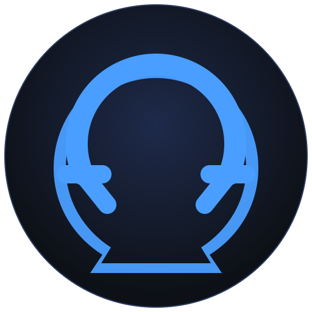

# Omega

<p align="center">
  
</p>

[](https://github.com/braveness23/omega/actions/workflows/ci.yml)
[](LICENSE)
[](https://en.cppreference.com/w/cpp/17)
[](CHANGELOG.md)

A C++ sequencing engine and MIDI library. The foundation for building serious music software.

Omega is a library, not an application. It handles timing, event scheduling, multi-track and pattern sequencing, and live performance control — with no opinion about what the interface looks like or what protocols it speaks.

> **v1.0.0 — stable release.** The C API (`omega.h`) is ABI-stable within a major version.
> See [CHANGELOG.md](CHANGELOG.md) for the full release history.

**[→ Getting Started](docs/GETTING_STARTED.md)** · **[→ API Reference](include/omega/omega.h)** · **[→ Architecture](docs/ARCHITECTURE.md)**

---

## What Makes Omega Different

Every DAW solves sequencing for one use case: linear tracks, tape-deck model. Nothing in the open source ecosystem provides an embeddable sequencer engine that covers all three classic paradigms — and then opens the door to virtually any sequencer ever conceived:

- **Timeline** — linear multi-track recording, the classic model
- **Pattern** — named loopable sequences, chainable into arrangements
- **Performance** — live cuing with real-time transpose, velocity scaling, and probabilistic variation

Beyond the three built-in modes, Omega's orchestration layer enables the full range of sequencer architectures:

- **Reactive / generative** — incoming events (MIDI, OSC) become source material via `EventInput`; generative sources produce events procedurally with no stored data
- **Modulated** — `ModulationBus` carries continuous parameter control (LFOs, envelopes, step modulators) readable by any source each cycle
- **Scale/chord-aware** — `PerformanceContext` provides shared musical state (scale, chord, groove) that multiple sources read without being wired to each other
- **Composable** — `TransformSource` composes sources into processing chains (quantize → humanize → chord-spread) without a separate patch graph
- **Chasing** — transport locate correctly reconstructs note, CC, and program state for any source that supports it

---

## Design

See [docs/ARCHITECTURE.md](docs/ARCHITECTURE.md) for the full architecture overview and links to all design documents.
Visual diagrams are in [docs/diagrams/](docs/diagrams/) — architecture layers, `process()` flow, performance slot state machine, and class relationships.

See [PROPOSAL.md](PROPOSAL.md) for the original vision document.

Key decisions at a glance:
- **C++17** core with a **stable C API** (`extern "C"`) for cross-language bindings
- **480 PPQN** tick resolution, **nanosecond** wall-clock precision
- **Caller-driven** engine with a **lock-free command queue** — no hidden threads
- **`std::pmr`** for swappable allocators — works on embedded targets without a heap
- **MIT license** — permissive for commercial and open source use
- **MIDI via libremidi** (MIT), **SMF via midifile** (BSD), **Ableton Link optional** (GPL v2+)

---

## Requirements

- C++17 compiler: GCC 10+, Clang 11+, MSVC 2019+
- CMake 3.16+
- Platform MIDI support: ALSA (Linux), CoreMIDI (macOS), WinMM (Windows)

---

## Building

```bash
git clone https://github.com/braveness23/omega.git
cd omega
cmake -B build -DOMEGA_BUILD_TESTS=ON
cmake --build build
ctest --test-dir build
```

Optional Ableton Link support (changes license to GPL v2+):
```bash
cmake -B build -DOMEGA_WITH_LINK=ON
```

---

## Quick Start

```cpp
#include <omega/engine.h>
#include <omega/commands.h>
#include <omega/test/mock_clock.h>
#include <omega/test/capturing_sink.h>
#include <cassert>

int main()
{
    // 1. Create an engine with a manually-advanced clock (use InternalClock for production).
    omega::MockClock clock;
    omega::Engine engine(&clock);

    // 2. Register an output sink (replace with a real MIDI sink in production).
    omega::CapturingSink sink;
    engine.add_sink(&sink);

    // 3. Add a track and route it to the sink.
    omega::TrackId track = engine.add_track("bass");
    engine.set_track_sink(track, sink.sink_id());

    // 4. Schedule a note: C4, velocity 100, duration 1 beat (480 ticks).
    omega::Event note = omega_make_note_on(0u, sink.sink_id(), 0, 60, 100, 480);
    engine.enqueue(omega::AddEventCmd{track, note});

    // 5. Start playback and advance one cycle past tick 0.
    engine.enqueue(omega::TransportCmd{omega::TransportAction::PLAY, 0u});
    clock.advance_ticks(1u);
    engine.process();

    // 6. The note fired — verify it.
    assert(sink.has_note_on(60, 0));
    return 0;
}
```

The C API version of the same example is in `cmake/smoke_test/main.cpp`.
Full API reference is in `include/omega/omega.h`; every function documents its thread
requirement, return values, and error codes.

---

## License

MIT — see [LICENSE](LICENSE).

When built with `OMEGA_WITH_LINK=ON`, the combined work is GPL v2+.
See [docs/design/07-extensions.md](docs/design/07-extensions.md) for details.

---

*In memory of Emile Tobenfeld.*
