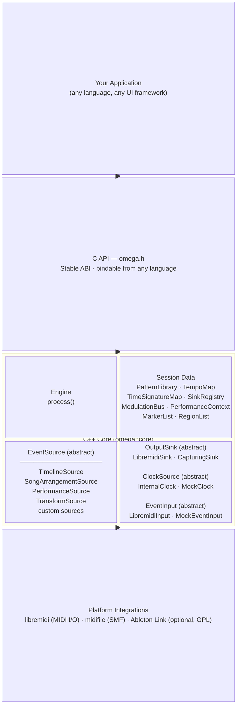

# Architecture Diagram

Omega is organized in three layers.

## Layer Responsibilities

| Layer | Stability | Purpose |
|---|---|---|
| **C API** (`omega.h`) | ABI-stable within MAJOR | Single cross-language boundary; all public handles are opaque pointers |
| **C++ Core** (`omega::core`) | No ABI guarantee | Engine, session data, timing, event dispatch — evolves freely |
| **Platform integrations** | Versioned separately | Real MIDI I/O, SMF file I/O, optional sync |
