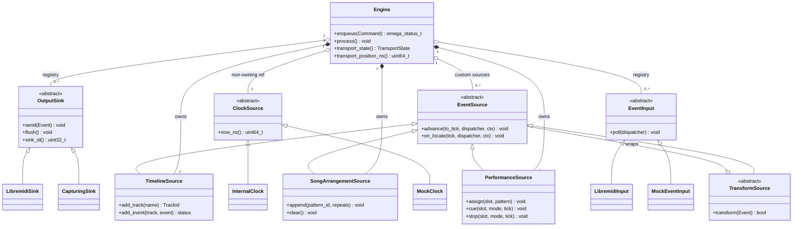

# Key Class Relationships

This diagram shows the primary relationships between Omega's public and internal classes.
Implementation details (private members, helper classes) are omitted for clarity.

## Ownership Rules

- `Engine` **owns** the three built-in sources (`TimelineSource`, `SongArrangementSource`,
  `PerformanceSource`) — they are created and destroyed with the engine.
- `Engine` holds **non-owning references** to sinks, clocks, custom sources, and inputs.
  Callers own these objects and must ensure they outlive the engine.
- Every `omega_*_create()` in the C API returns a caller-owned handle; the caller must
  call the matching `omega_*_destroy()` before `omega_engine_destroy()`.
