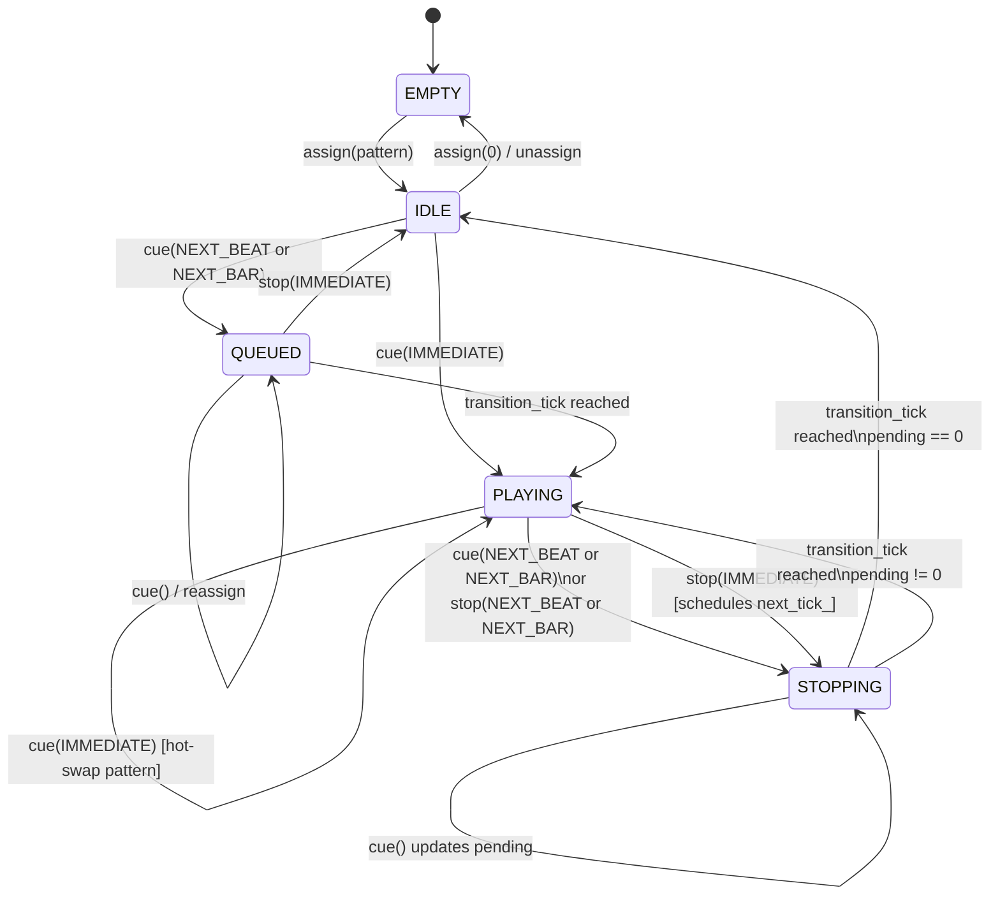

# PerformanceSource Slot State Machine

Each of the 64 performance slots follows this state machine.
See [`docs/design/05-pattern-state-machine.md`](../design/05-pattern-state-machine.md) for the full specification.

## State Descriptions

| State | Meaning |
|---|---|
| `EMPTY` | No pattern assigned; slot is unused |
| `IDLE` | Pattern assigned but not playing; awaiting a cue command |
| `QUEUED` | Cue command received; waiting for the boundary tick to start |
| `PLAYING` | Pattern is actively looping; events are dispatched each cycle |
| `STOPPING` | Stop (or pattern-switch) scheduled; plays until `transition_tick`, then transitions |

## Cue Modes

| Mode | Boundary |
|---|---|
| `OMEGA_CUE_IMMEDIATE` | Transitions at the very next `process()` cycle |
| `OMEGA_CUE_AT_BOUNDARY` | Next loop boundary of the currently-playing pattern |
| `OMEGA_CUE_QUANTIZED` | Next multiple of the pattern length from session tick 0 |
| `OMEGA_CUE_BAR` | Next bar boundary per the `TimeSignatureMap`; falls back to loop boundary in freeform mode |
