# engine.process() Flow

Called from the timing thread (typically by `OmegaTimer`) once per cycle.

```mermaid
flowchart TD
    A([process&#40;&#41; called]) --> B[Drain command queue\nSpscQueue::pop in a loop\napply each Command]
    B --> C{Transport\nSTOPPED?}
    C -- yes --> Z([return])
    C -- no --> D[Clear InputBus]
    D --> E[Poll all EventInputs\nEventInput::poll → InputBus]
    E --> F[Build ProcessContext\nInputBus · ModulationBus · PerformanceContext]
    F --> G[Advance custom sources\nin priority order\n0=MODULATOR → 1=CONTEXT → 2=PLAYBACK]
    G --> H[Advance built-in sources\nTimelineSource → SongArrangementSource → PerformanceSource]
    H --> I[Flush all OutputSinks\nOutputSink::flush]
    I --> J[Update last_position_ns_]
    J --> Z
```

## Key Invariants

- **No allocation** on the timing thread. All data structures are pre-allocated.
- **No blocking** — sinks and inputs must return immediately.
- **SPSC invariant** — exactly one producer (`enqueue()`) and one consumer (`process()`).
- **Catch-up** — if a cycle runs late, all overdue events fire in order before returning.
  Events are never skipped.
- **Source order matters** — modulator sources write to `ModulationBus` first; playback
  sources read it in the same cycle.
